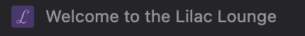

# Milestone 1 Project: <span style="color:#D891EF; background-color:#4D356E;padding: 5px">Lilac Lounge</span>

This project imagines a local music and events venue _Lilac Lounge_ who would like to have a new website in order to better promote the business and have more customers.

## Contents

1.  <details open>
       <summary><a href="#user-experience-ux">User Experience (UX)</a></summary>

       <ul>
       <li><details>
       <summary><a href="#project-goals">Project Goals</a></summary>

    - [`Customer` goals](#customer-goals)
    - [`Patron` goals](#patron-goals)
    - [Business goals](#business-goals)
    - [User Stories](#user-stories)
        </details></li>

         <li><details>
         <summary><a href="#design">Design</a></summary>

      - [Wireframes](#wireframes)
      - [Fonts](#fonts)
      - [Icons](#icons)
      - [Colours](#colours)
      - [Styling](#styling)
         </details></li>
         </ul>
      </details>

2.  <details open>
      <summary><a href="#features">Features</a></summary>

    </details>

3.  <details open>
      <summary><a href="#technologies-used">Technologies Used</a></summary>

    - [Languages](#languages)
    - [Frameworks](#frameworks)
    - [Libraries](#libraries)
    - [Platforms](#platforms)
    - [Tools and Programs](#tools-and-programs)

    </details>

4.  <details open>
      <summary><a href="#testing">Testing</a></summary>

    </details>

5.  [GitHub Deployment](#github-deployment)

6.  <details open>
      <summary><a href="#credits">Credits</a></summary>

    </details>

## User Experience (UX)

### Project goals

This project aims to help the _Lilac Lounge_ promote their business by producing an eye-catching website that will improve their online presence.

The target audience will be:

- venue-booking `customers`: anyone looking to hire out a venue
- prospective `patrons`: audience members who may want to see a show at the venue

#### `Customer` goals

Customers may be musicians or other entertainers looking to hire a venue where their fans can come to see them perform. They may also be people who are looking to hire a function room for a private event like a birthday party.

Customer goals are:

- Evaluating if the venue will be suitable for their needs
- Information relating to the physical characteristics of the venue, e.g. size, capacity, location
- Can easily contact the venue to make bookings

Beginning on the home page, the customer can see the upcoming events at the _Lilac Lounge_ which can help to give them an idea of kind of _vibe_ they may find.

Right after the events calendar there is a call-to-action directed at customers: a link to the Contact form that the customer can click if their interest is piqued.

The website will help the customer to achieve these goals because:

- information about the venue is summarised on a dedicated _About Us_ page
- The Gallery will contain event photography showcasing the venue in action, which can serve to present the _Lilac Lounge_ as a well run popular venue
- the Contact form is easily accessed as a modal from any page of the website

#### `Patron` goals

Patrons are people who will visit the venue to see a show or attend an event.

Patron goals are:

- To find out what's on at the _Lilac Lounge_
- To have a good time

The website will reassure patrons that the _Lilac Lounge_ will allow them to achieve these goals because:

- the event calendar on the homepage will show them at a glance the upcoming events at the venue
- the gallery shows images of people having a good time and invite patrons to come along to have a good too

#### Business goals

The _business_ is the _Lilac Lounge_.

The goals of the business are:

- raise the profile of the _Lilac Lounge_ as a music and events venue
- attract more customers
- attract more patrons

The website can help to achieve these objectives because:

- when so much is accessible online, having a compelling online presence is essential to allow a business to be seen
- customers and patrons go hand in hand:
  - If the venue is seen to be able to draw a higher number of patrons, then that can attract more (and perhaps more prestigious) customers, who can be reassured that the venue is able to accommodate their events and/or provide them with an audience.
  - If the venue attracts big names and puts on more events, it will generate buzz and attract more patrons

#### User Stories

As a customer, I want to:

1. know what kind of events the venue has had experience hosting
2. learn about the physical characteristics of the venue:
   - size
   - capacity
   - location
3. easily contact the venue to discuss hiring the venue

As a patron, I want to:

1. know what's on at the _Lilac Lounge_
2. know how to get to the venue
3. be reassured that I'll have a good time

## Design

### Colours

<table style="border: 1px solid grey; border-collapse: collapse; font-family: monospace; margin: 0 auto">
  <tr>
    <th style="text-align: center;">Violet</th>
    <th style="text-align: center;">Dark violet</th>
    <th style="text-align: center;">Pale Purple</th>
    <th style="text-align: center;">Mauve</th>
    <th style="text-align: center;">White</th>
  </tr>
  <tr style="height: 4em;">
    <td style="background-color: #d891ef"></td>
    <td style="background-color: #4d356e"></td>
    <td style="background-color: #ecdeff"></td>
    <td style="background-color: #d8bdff"></td>
    <td style="background-color: #ffffff"></td>
  </tr>
  <tr>
    <td style="text-align: center;">#d891ef</td>
    <td style="text-align: center;">#4d356e</td>
    <td style="text-align: center;">#ecdeff</td>
    <td style="text-align: center;">#d8bdff</td>
    <td style="text-align: center;">#ffffff</td>
  </tr>
</table>

## Features

### The contact form

Initially the contact form was going to be on its own separate page. However, as I became more familiar with Bootstrap, I decided that it would be more effective to implement the contact form via a Bootstrap Modal in order to maintain focus on the content.

The benefit of using a modal for the contact form is that the user is not navigated away from the site content, and nor would they need to manually return to the originating page. Thus the user may be encouraged to continue exploring the website. Meanwhile, a separate contact form _page_ does not offer anything else besides a contact form which could prematurely signal the end of the user journey.

#### DRYing the contact form

It should be possible to access the contact form modal on any page of the website. In order to avoid duplicating the code of the contact form on every page, the HTML of the contact form is stored in the file `contact.html` and loaded dynamically using JavaScript wherever it is required. This approach also makes it easier to update the contact form as it only needs to be changed in one place.

## Technologies Used

### Languages

- [HTML5](https://en.wikipedia.org/wiki/HTML5)
- [CSS3](https://en.wikipedia.org/wiki/Cascading_Style_Sheets)
- [Javascript](https://developer.mozilla.org/en-US/docs/Web/JavaScript) to avoid repeating contact form code by dynamically loading the HTML whenever it is required

### Frameworks

- [Bootstrap 5.3.3](https://getbootstrap.com/): to assist with responsiveness and style, and for form, navbar and modal

### Libraries

- [Google Fonts](https://fonts.google.com)
- [Fontawesome](https://fontawesome.com/) for icons

### Platforms

- [Github](https://github.com/): for version control and deployment
- [Gitpod](https://gitpod.io/): cloud-based IDE for project development

### Tools and Programs

- [favicon.io](https://favicon.io/): to produce an initial version of the favicon, and ultimately to generate the favicon image files that would be used to implement the favicon
- [Figma](https://www.figma.com/): to create a revised version of the favicon, export it to a file that I then uploaded to favicon.io to generate favicon image files
- [Balsamiq](https://balsamiq.com/)
  - To create wireframes.
- [Favicon Generator](https://www.favicon-generator.org/)
  - Favicons
- [Mockup Generator](https://techsini.com/multi-mockup/index.php)
  - For device mockup images.
- [Coolors](https://coolors.co/)
  - Creating color pallettes.

## Testing

### General testing

#### JavaScript to load contact form

The small snippet of JavaScript used to load the contact form was tested manually ensuring that contact form links correctly open the contact form in a modal

#### Favicon visibility

When adding the favicon I soon realised that the combination of colours used would result in low contrast and poor visibility:

<figure style="text-align: center;">
  
  <figcaption style="font-size:75%">Original favicon as it appears on the browser tab</figcaption>
</figure>

I therefore created a new version that would be clearer and easier to see at a small size, still adhering to the colour palette:

|                Old favicon                 |                New favicon                 |
| :----------------------------------------: | :----------------------------------------: |
| ![old version of the favicon][old-favicon] | ![new version of the favicon][new-favicon] |

[old-favicon]: assets/docs/readme-images/old-favicon.png
[new-favicon]: assets/docs/readme-images/new-favicon.png

### As a Progressive web app


## GitHub Deployment

### GitHub Pages

The project was deployed to GitHub Pages using the following steps...

1. Log in to GitHub and locate the [GitHub Repository](https://github.com/)
2. At the top of the Repository (not top of page), locate the "Settings" Button on the menu.
   - Alternatively Click [Here](https://raw.githubusercontent.com/) for a GIF demonstrating the process starting from Step 2.
3. Scroll down the Settings page until you locate the "GitHub Pages" Section.
4. Under "Source", click the dropdown called "None" and select "Master Branch".
5. The page will automatically refresh.
6. Scroll back down through the page to locate the now published site [link](https://github.com) in the "GitHub Pages" section.

### Forking the GitHub Repository

By forking the GitHub Repository we make a copy of the original repository on our GitHub account to view and/or make changes without affecting the original repository by using the following steps...

1. Log in to GitHub and locate the [GitHub Repository](https://github.com/)
2. At the top of the Repository (not top of page) just above the "Settings" Button on the menu, locate the "Fork" Button.
3. You should now have a copy of the original repository in your GitHub account.

### Making a Local Clone

1. Log in to GitHub and locate the [GitHub Repository](https://github.com/)
2. Under the repository name, click "Clone or download".
3. To clone the repository using HTTPS, under "Clone with HTTPS", copy the link.
4. Open Git Bash
5. Change the current working directory to the location where you want the cloned directory to be made.
6. Type `git clone`, and then paste the URL you copied in Step 3.

```
$ git clone https://github.com/YOUR-USERNAME/YOUR-REPOSITORY
```

7. Press Enter. Your local clone will be created.

```
$ git clone https://github.com/YOUR-USERNAME/YOUR-REPOSITORY
> Cloning into `CI-Clone`...
> remote: Counting objects: 10, done.
> remote: Compressing objects: 100% (8/8), done.
> remove: Total 10 (delta 1), reused 10 (delta 1)
> Unpacking objects: 100% (10/10), done.
```

Click [Here](https://help.github.com/en/github/creating-cloning-and-archiving-repositories/cloning-a-repository#cloning-a-repository-to-github-desktop) to retrieve pictures for some of the buttons and more detailed explanations of the above process.

### Credits

#### Code

[web.dev: Add a web app manifest](https://web.dev/articles/add-manifest)
was helpful for working with the `site.webmanifest` file that accompanies the favicon files produced by favicon.io.

[maximorlov.com: Deploying to Github Pages? Don't Forget to Fix Your Links
](https://maximorlov.com/deploying-to-github-pages-dont-forget-to-fix-your-links/) was helpful for correcting the paths in `site.webmanifest`

#### Media

#### Acknowledgements

- My mentor for their useful tips and helpful insights
