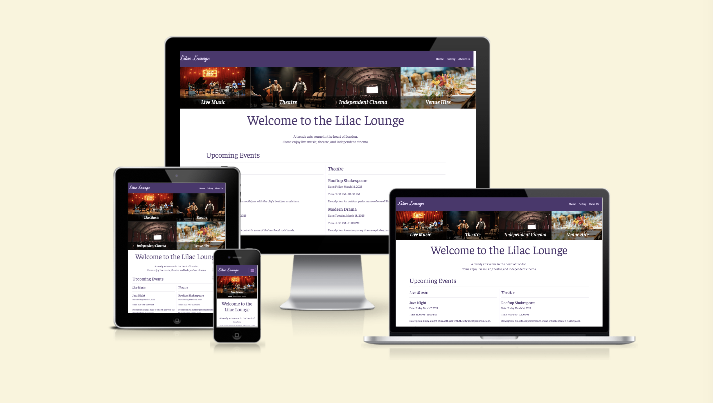
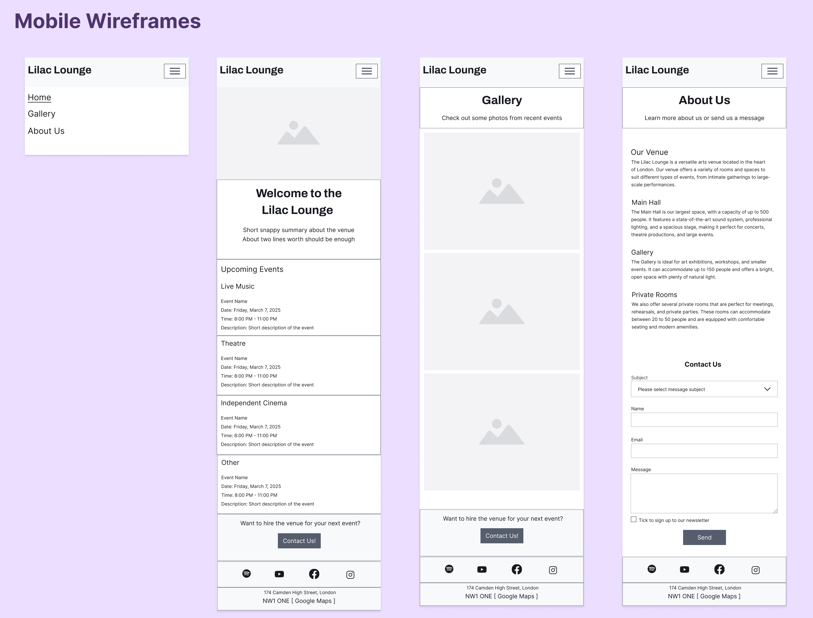
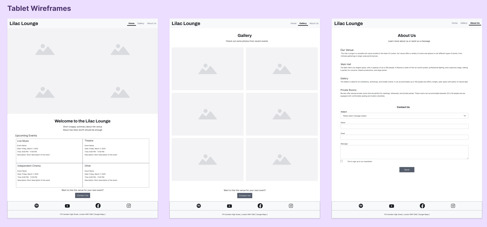
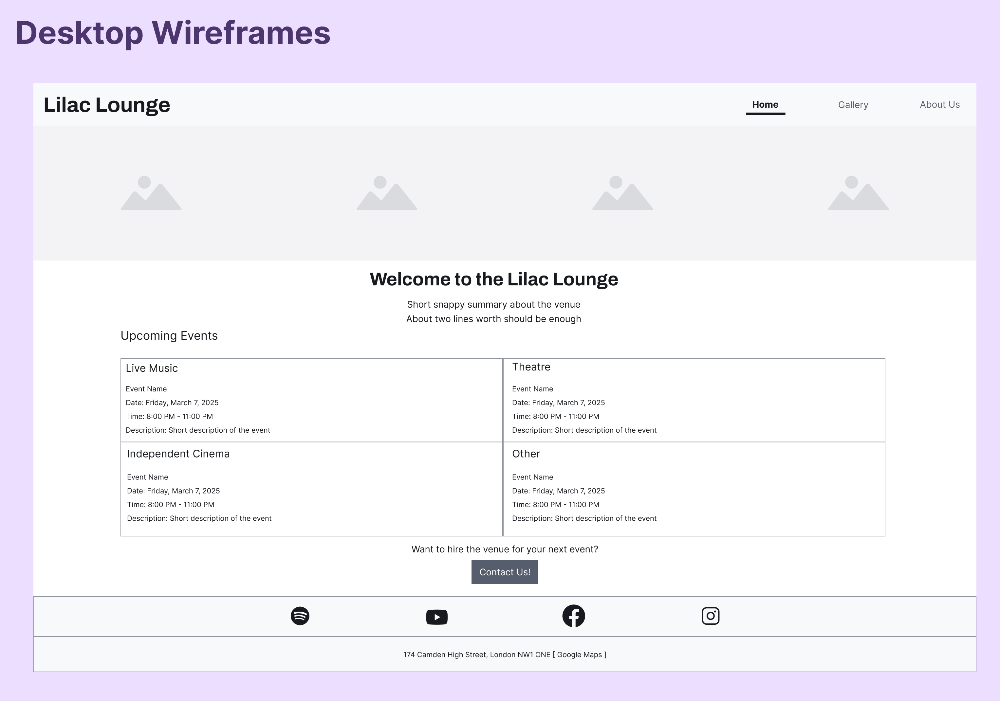
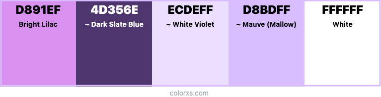
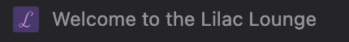
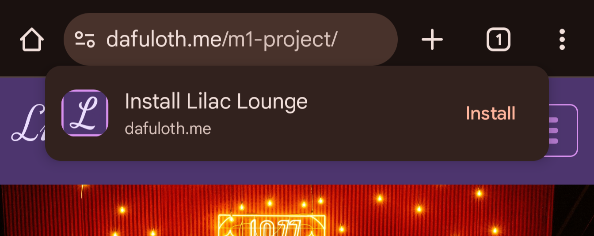
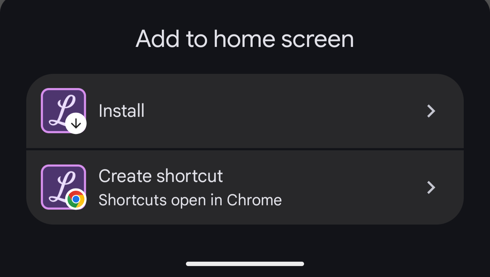
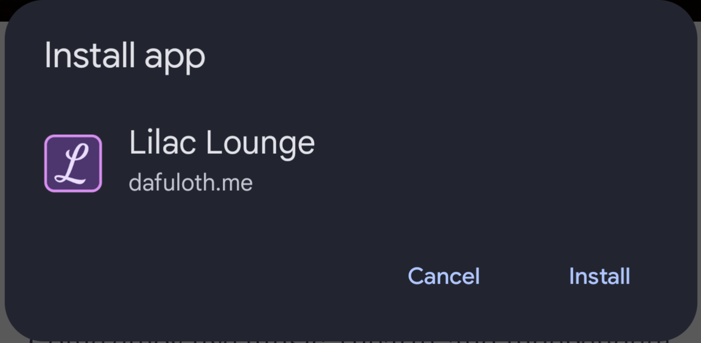

# Milestone 1 Project: Lilac Lounge

Live project: <https://dafuloth.github.io/m1-project>  
_**dafuloth.github.io** URLs redirect to **dafuloth.me** because I have a custom domain for my GitHub user site_



This project imagines a local music and events venue _Lilac Lounge_ that would like to have a new website in order to better promote the business and attract more customers.

## Contents

1.  <details open>
       <summary><a href="#user-experience-ux">User Experience (UX)</a></summary>

       <ul>
       <li><details>
       <summary><a href="#project-goals">Project Goals</a></summary>

    - [`Customer` goals](#customer-goals)
    - [`Patron` goals](#patron-goals)
    - [Business goals](#business-goals)
    - [User Stories](#user-stories)
        </details></li>
         <li><details>
         <summary><a href="#design">Design</a></summary>

      - [Wireframes](#wireframes)
      - [Fonts](#fonts)
      - [Icons](#icons)
      - [Colours](#colours)
      - [Styling](#styling)
         </details></li>
         </ul>
      </details>

2.  <details open>
      <summary><a href="#features">Features</a></summary>

    </details>

3.  <details open>
      <summary><a href="#technologies-used">Technologies Used</a></summary>

    - [Languages](#languages)
    - [Frameworks](#frameworks)
    - [Libraries](#libraries)
    - [Platforms](#platforms)
    - [Tools and Programs](#tools-and-programs)

    </details>

4.  <details open>
      <summary><a href="#testing">Testing</a></summary>

    - [JavaScript to load contact form](#javascript-to-load-contact-form)
    - [Favicon visibility](#favicon-visibility)
    -

    </details>

5.  [GitHub Deployment](#github-deployment)

6.  [References](#references)

7.  [Acknowledgements](#acknowledgements)

## User Experience (UX)

### Project goals

This project aims to help the _Lilac Lounge_ promote their business by producing an eye-catching website that will improve their online presence.

The website will be aimed at:

- venue-booking `customers`: anyone looking to hire out a venue
- prospective `patrons`: audience members who may want to see a show at the venue

#### `Customer` goals

Customers may be musicians or other entertainers looking to hire a venue where their fans can come to see them perform. They may also be people looking to hire a function room for a private event like a birthday party.

Customer goals are:

- Evaluating if the venue will be suitable for their needs
- Information relating to the physical characteristics of the venue, e.g. size, capacity, location
- Easily contact the venue to make a booking

On the Home page, customers can see the upcoming events at the _Lilac Lounge_, which can help give them an idea of the kind of vibe they may find.

There is a call-to-action at the end of pages directed at customers: a link to the Contact form that Customers can click if their interest is piqued.

The website will help Customers achieve these goals because:

- Information about the venue is summarised on a dedicated _About Us_ page
- Gallery will contain event photography showcasing the venue in action, which can serve to present the _Lilac Lounge_ as a well-run popular venue
- Contact form is easily accessed as a modal from any page of the website

#### `Patron` goals

Patrons are people who will visit the venue to see a show or attend an event.

Patron goals are:

- To find out what's on at the _Lilac Lounge_
- To have a good time

The website will reassure patrons that the _Lilac Lounge_ will allow them to achieve these goals because:

- the event calendar on the homepage will show them upcoming events at the venue at a glance
- the gallery shows images of fun and exciting things happening at the venue, to convey the sense that it is a place where a good time may be had

#### Business goals

The _business_ is the _Lilac Lounge_.

The goals of the business include:

- raise the profile of the _Lilac Lounge_ as a music and events venue
- attract more customers
- attract more patrons

The website can help to achieve these objectives because:

- when so much is accessible online, having a compelling online presence is essential to allow a business to be seen
- customers and patrons go hand in hand:
  - If the venue is seen to be able to draw a higher number of patrons, then that can attract more (and perhaps more prestigious) customers, who can be reassured that the venue is able to accommodate their events and/or provide them with an audience.
  - If the venue attracts big names and puts on more events, it will generate buzz and attract more patrons.

#### User Stories

As a customer, I want to:

1. know what kind of events the venue has had experience hosting
2. learn about the physical characteristics of the venue:
   - size
   - capacity
   - location
3. easily contact the venue to discuss hiring the venue

As a patron, I want to:

1. know what's on at the _Lilac Lounge_
2. know how to get to the venue
3. be reassured that I'll have a good time

## Design

### Wireframes

Wireframes were created in Figma and can be viewed [here](https://www.figma.com/design/ihBXh6M1pJxRHR5eMEqio5/Latest-M1-Wireframes?node-id=0-1&t=kn1R2iVQ3QHEdUtQ-1)

#### Mobile wireframes



#### Tablet wireframes



#### Desktop wireframe

For the Desktop layout, the main change will be on the Home page where the hero images are displayed in a row to take advantage of the increased horizontal space that is available on desktop. The Gallery and About Us pages are mostly the same on Desktop as they were on Tablet.



### Fonts

Fonts have been selected from Google Fonts to support the impression of the _Lilac Lounge_ as a trendy and sophisticated venue. The cursive _Dynalight_ font is used for the logo, while the _Faustina_ serif font is used as the main font of the website.

### Colours



[Link to palette on colorxs.com](https://www.colorxs.com/palette/editor/d891ef-4d356e-ecdeff-d8bdff-ffffff)

## Features

> **Note**: Certain website functionalities (nav toggler, carousel, modal, contact form loader) require JavaScript. Since JavaScript is typically enabled by default, it is reasonable to assume it will be available.

### Navigation bar

The header contains a responsive navigation bar for the website which has been implemented via the Bootstrap `navbar` component, styled according to our design.

#### Logo

On the far left of the navbar we may choose to display an image as a logo. Currently a text logo is used, displaying the business name in the imported _Dynalight_ Google Font. Since the text serves as a logo, text selection has been disabled via CSS.

### Responsive Hero

The home page has a "hero image" that is four separate images put together that highlight the venue's main offerings.

The hero image adapts to the screen size:

- On mobile, showing all the images at the same time would overwhelm the page due to the smaller screen size. So instead, a carousel automatically transitions between the four images so that each image can be given full prominence without the user having to manually navigate between them. If the user had to scroll to see all the images, they may not bother and would miss out on what we want to convey.

- On tablet where there is more space all four images can be displayed at the same time in a 2-by-2 arrangement

- On larger screens, the desktop view displays all four images in a row as a banner across the the entire width of the screen.
  I use four images to illustrate what the _Lilac Lounge_ offers, i.e. music events, theatre events, independent cinema, venue hire. Due to the more limited horizontal space on mobile, I use a Bootstrap carousel to display the images so each one can capture the visitors full attention without having taking up the whole page. On larger screens where more space is available, it is sufficient to have a 2 by 2 layout for medium size screens or a row of 4 for wider screens.

#### Hero images

I used Leonardo.Ai to generate the "theatre" hero image while the rest were acquired from Unsplash. Due to the varying aspect ratios, the height of the images varies when displayed by the carousel at full-width of the screen. The result is that the transition between images is not very smooth.

I determined that my options for resolving this were to either manually edit the images and crop them to the same aspect ratio, or display the images in a container of fixed aspect ratio. I decided that the latter option is the more efficient and scalable approach.

I was unsure how best to achieve this so I asked Copilot. It responded with the following CSS classes which I have used:

```css
.carousel-image-wrapper {
  position: relative;
  width: 100%;
  padding-top: 56.25%; /* 16:9 aspect ratio (9 / 16 * 100) */
  overflow: hidden;
}

.carousel-image-wrapper img {
  position: absolute;
  top: 0;
  left: 0;
  width: 100%;
  height: 100%;
  object-fit: cover;
}
```

Together, `overflow: hidden` on the wrapper and `object-fit: cover` on the images have the effect of cropping the images to fit a 16:9 aspect ratio.

I applied a similar approach to display the hero images on medium and larger screens.

### The contact form

Initially, the contact form was only going to be on its own separate page. However, as I became more familiar with Bootstrap I decided that there was a better way. I could maintain focus on the content by displaying the contact form in a Bootstrap Modal.

The benefit of using a modal for the contact form is that the user would not be navigated away from the site content, nor would they need to manually return to the originating page. The user might thus be encouraged to continue exploring the website. Meanwhile, only having a separate contact form _page_ does not offer anything else besides a contact form which could prematurely signal the end of the user journey.

A standalone version of the Contact form can still be found incorporated into the About Us page, which will serve to summarise information about the venue and offer a way for users to send a message to the venue management.

#### DRYing the contact form

To avoid duplicating the code of the contact form on every page that may need to be able to show the contact form, the HTML of the contact form is stored in the file `contact-form.html` and loaded dynamically using JavaScript wherever it is required. This approach also makes it easier to update the contact form as it only needs to be changed in one place.

I do not apply a similar technique to the header and footer because they are static content and are less likely to change.

### As a Progressive Web App (PWA)

PWAs make the experience of using a web application similar to that of using a platform-specific application. For example, while out of scope for this project, it is even possible to publish a PWA to the Google Play Store so that users can install it as they would any other app from the app store. This provides an easy way to offer a mobile app without having to specifically develop one.

Any website or web application can be set up to work as a Progressive Web App through a JSON file called a web app manifest, which for this project is the file **site.webmanifest** and is where icons and colour scheme are specified.

Two main features of PWAs are offline availability and installability. Offline availability (i.e. functioning without an internet connection) requires more work and was deemed out of scope for this project. Installability means that the website can be installed like a native app: having its own app icon and launching in its own window separate from the browser.

On an Android phone it looks like this:

|          PWA app icon on Home screen           | PWA launches with splash screen  |     PWA opens in own window      |
| :--------------------------------------------: | :------------------------------: | :------------------------------: |
| ![PWA icon on Home screen][pwa-installed-icon] | ![PWA splash screen][pwa-splash] | ![PWA in own window][pwa-mobile] |

[pwa-installed-icon]: docs/readme-images/pwa-installed-icon.png
[pwa-splash]: docs/readme-images/pwa-splash.png
[pwa-mobile]: docs/readme-images/pwa-mobile.png

On desktop (Chrome on MacOS) it looks like this:

|               PWA app icons                |      PWA opens in own window      |
| :----------------------------------------: | :-------------------------------: |
| ![PWA installed in Chrome][macos-pwa-icon] | ![PWA in own window][pwa-desktop] |

[macos-pwa-icon]: docs/readme-images/macos-pwa-icon.png
[pwa-desktop]: docs/readme-images/pwa-desktop.png

The installation experience is demonstrated in [Testing](#testing).

## Technologies Used

### Languages

- [HTML5](https://en.wikipedia.org/wiki/HTML5)
- [CSS3](https://en.wikipedia.org/wiki/Cascading_Style_Sheets)
- [Javascript](https://developer.mozilla.org/en-US/docs/Web/JavaScript) to avoid repeating the contact form code by dynamically loading the HTML whenever it is required

### Frameworks

- [Bootstrap 5.3.3](https://getbootstrap.com/): to assist with responsiveness and style, and for form, navbar and modal

### Libraries

- [Google Fonts](https://fonts.google.com)
- [Bootstrap Icons](https://icons.getbootstrap.com/) for icons

### Platforms

- [Github](https://github.com/): for version control and deployment

### Tools and Programs

- [favicon.io](https://favicon.io/): to produce an initial version of the favicon, and ultimately to generate the favicon image files that would be used to implement the favicon
- [Figma](https://www.figma.com/): to create wireframes. Also to create a revised version of the favicon, export it to a file that I then uploaded to favicon.io to generate favicon image files.
- [Am I Responsive?](https://ui.dev/amiresponsive) for device mockup images.
- [colorxs.com](https://www.colorxs.com/palette/editor/d891ef-4d356e-ecdeff-d8bdff-ffffff) for generating and visualising color palettes

## Testing

### JavaScript to load contact form

The small snippet of JavaScript used to load the contact form was tested manually to ensure that contact form links correctly open the contact form in a modal

### Favicon visibility

When adding the favicon, I soon realised that the combination of colours used would result in low contrast and poor visibility:

<figure>
  
  <figcaption style="font-size:75%">Original favicon as it appears on the browser tab</figcaption>
</figure>

To address this, I created a new version that is clearer and easier to see at a small size, while still adhering to the colour palette:

|                Old favicon                 |                New favicon                 |
| :----------------------------------------: | :----------------------------------------: |
| ![old version of the favicon][old-favicon] | ![new version of the favicon][new-favicon] |

[old-favicon]: docs/readme-images/old-favicon.png
[new-favicon]: docs/readme-images/new-favicon.png

### As a Progressive Web App

#### On Mobile

The ability to install the _Lilac Lounge_ website as an app was tested using Google Chrome on an Android phone. While I do not have an iPhone to test with, a similar process exists on iPhones as well.

- PWAs can be installed via an installation prompt that appears on the first visit, or via the **Add to home screen** option from the browser menu  
  &nbsp;

- Either way, installation can be started  
  

## Troubleshooting and Bug-Fixing

### Google Fonts

|                                                               |                                                                |
| :-----------------------------------------------------------: | :------------------------------------------------------------: |
| **Issue**: Serif font being used instead of the imported font |       ![Imported font not being used][logo-text-problem]       |
|      **Cause**: `@import` not at the top of the CSS file      | ![Incorrect location of CSS import rule][incorrect-css-import] |
|         **Fix**: Move @import rule to top of CSS file         |  ![@import rule moved to top of CSS file][correct-css-import]  |
|            **Result**: Imported font takes effect             |    ![Import font is now correctly applied][logo-text-fixed]    |

[logo-text-problem]: docs/readme-images/incorrect-logo-text-font.png
[incorrect-css-import]: docs/readme-images/incorrect-css-import.png
[correct-css-import]: docs/readme-images/correct-css-import.png
[logo-text-fixed]: docs/readme-images/correct-logo-text-font.png

### Preventing "flash of unstyled text"

This is an issue that comes under general testing as it is not a bug per se. By default, the imported CSS for the _Dynalight_ Google Font sets the value of `font-display` to `swap`. Although this is technically fine, it results in the behaviour whereby the logo text is immediately displayed in the serif fallback font because the custom font needs to be downloaded and then the text font is swapped for the downloaded one, i.e. _flash of unstyled text_.

As this could be distracting, the property has been set to `fallback` instead. This means that the browser will initially hide the text and briefly wait for the custom font. If the font is taking too long to download, the browser will use the fallback serif font and change it to the custom font when available.

## GitHub Deployment

> **Note**: A custom domain is used for the GitHub Pages user site on this GitHub account, so the custom domain is applied to all project sites including this one. Therefore, it is normal that visiting the live deployment URL <https://dafuloth.github.io/m1-project> will open <https://dafuloth.me/m1-project>.

### GitHub Pages

The project was deployed to GitHub Pages using the following steps...

1. Log in to GitHub and locate the [GitHub Repository](https://github.com/)
2. At the top of the Repository (not top of page), locate the "Settings" Button on the menu.
3. Scroll down the Settings page until you locate the "GitHub Pages" section.
4. Under "Source", click the dropdown called "None" and select "Master Branch".
5. The page will automatically refresh.
6. Scroll back down through the page to locate the now published site [link](https://github.com) in the "GitHub Pages" section.

### Forking the GitHub Repository

By forking the GitHub Repository we make a copy of the original repository on our GitHub account to view and/or make changes without affecting the original repository by using the following steps...

1. Log in to GitHub and locate the [GitHub Repository](https://github.com/)
2. At the top of the Repository (not top of page) just above the "Settings" Button on the menu, locate the "Fork" Button.
3. You should now have a copy of the original repository in your GitHub account.

### Making a Local Clone

1. Log in to GitHub and locate the [GitHub Repository](https://github.com/)
2. Under the repository name, click "Clone or download".
3. To clone the repository using HTTPS, under "Clone with HTTPS", copy the link.
4. Open Git Bash
5. Change the current working directory to the location where you want the cloned directory to be made.
6. Type `git clone`, and then paste the URL you copied in Step 3.

```
$ git clone https://github.com/YOUR-USERNAME/YOUR-REPOSITORY
```

7. Press Enter. Your local clone will be created.

```
$ git clone https://github.com/YOUR-USERNAME/YOUR-REPOSITORY
> Cloning into `CI-Clone`...
> remote: Counting objects: 10, done.
> remote: Compressing objects: 100% (8/8), done.
> remove: Total 10 (delta 1), reused 10 (delta 1)
> Unpacking objects: 100% (10/10), done.
```

Click [here](https://help.github.com/en/github/creating-cloning-and-archiving-repositories/cloning-a-repository#cloning-a-repository-to-github-desktop) to retrieve pictures for some of the buttons and more detailed explanations of the above process.

### References

[DigitalOcean: How To Scale and Crop Images with CSS object-fit](https://www.digitalocean.com/community/tutorials/css-cropping-images-object-fit#using-object-fit-cover)

[web.dev: Progressive Web Apps](https://web.dev/explore/progressive-web-apps) to learn about Progressive Web Apps (PWAs)

[web.dev: Add a web app manifest](https://web.dev/articles/add-manifest)
was helpful for working with the `site.webmanifest` file that accompanies the favicon files produced by favicon.io.

[maximorlov.com: Deploying to Github Pages? Don't Forget to Fix Your Links](https://maximorlov.com/deploying-to-github-pages-dont-forget-to-fix-your-links/) was helpful for correcting the paths in `site.webmanifest`

[How To Disable Text Selection in HTML/CSS](https://www.w3schools.com/howto/howto_css_disable_text_selection.asp)

[font-display](https://css-tricks.com/almanac/properties/f/font-display/) helps to understand the consequences of the `font-display` CSS property

### Media

- Unsplash for photos. Individual image credits included in code comments
- Leonardo.ai to generate images:
  - [theatre image](https://cdn.leonardo.ai/users/cb73d82b-ab4a-4db0-85df-542867d12132/generations/1851823e-5b1f-4611-93d2-e60cbd447635/Leonardo_Lightning_XL_Photorealistic_image_showing_actors_on_a_0.jpg)

### Acknowledgements

- My mentor for their useful tips and helpful insights
